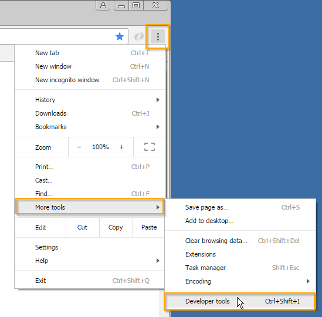
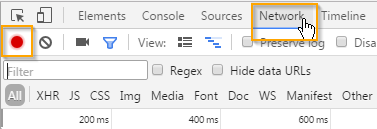
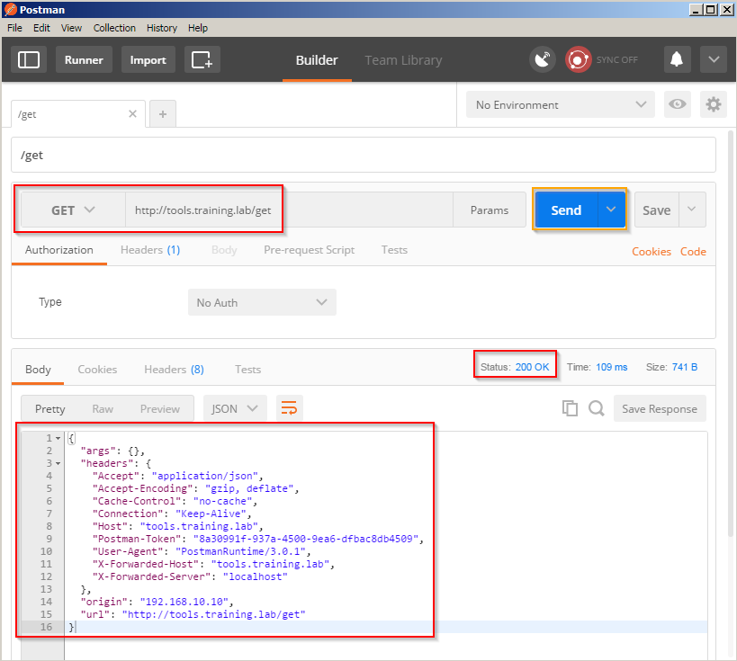
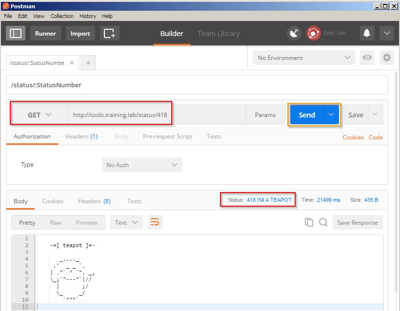
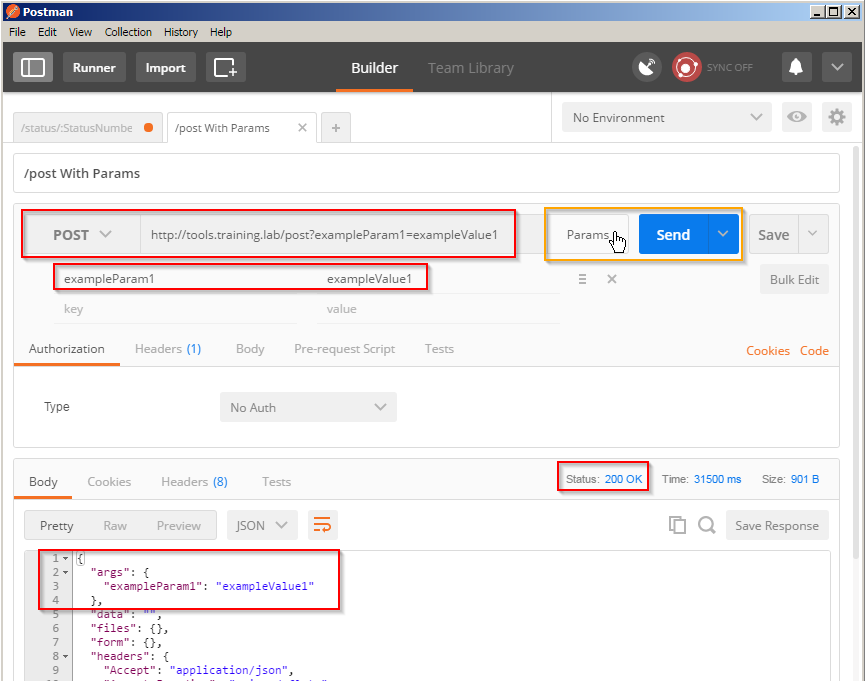
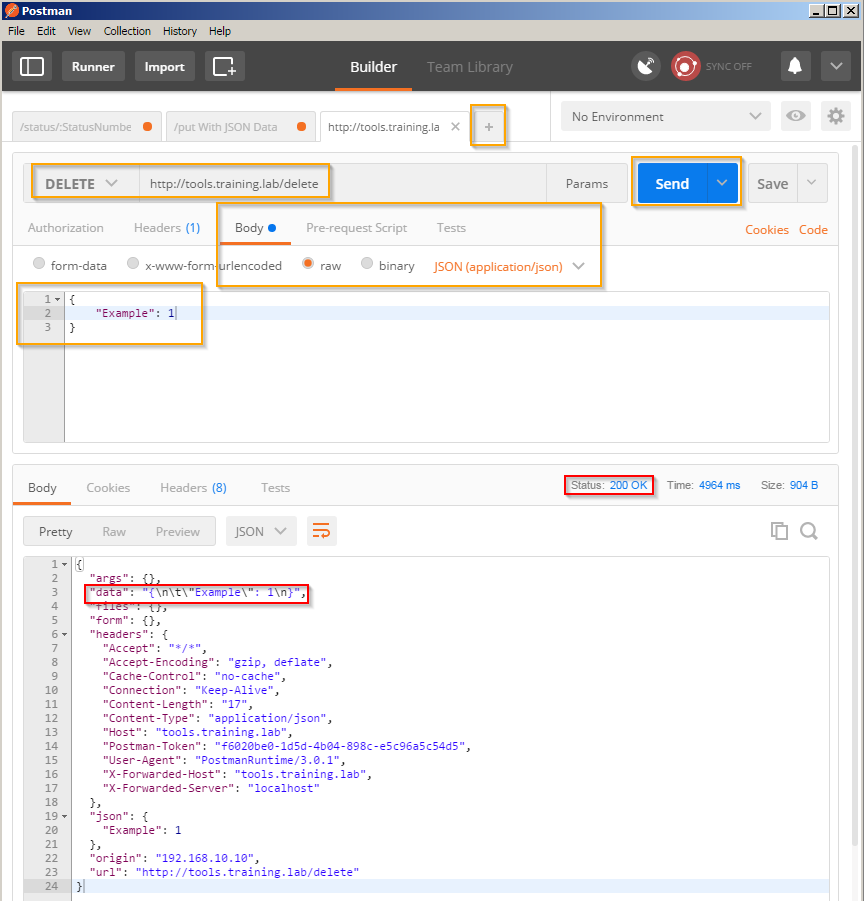

# Becoming Familiar with REST

## Overview

In this exercise, you will get started and familiar with RESTful services within the lab environment. We will begin by looking at a RESTful testing service running within the lab using a standard web browser, then we will move on to becoming acclimated with the REST client POSTMAN. Becoming familiar with RESTful services is important for automating NetScaler via NITRO as NITRO is a RESTful API. You will utilize these fundamentals in later exercises.

## Exercise 1: HTTPBin – HTTP GETs with a Web Browser

1. Open a new window in Google Chrome and head to [https://httpbin.org/](https://httpbin.org/)

> Note: some images in this guide reference tools.tools.training.lab, please be sure to subsitute this URL for httpbin.org

2. Open the **Google Chrome Developer Tools** by clicking on the **menu at the top right** of the browser and heading to **More tools**, followed by **Developer tools.**



3. Open the **Network** tab and be sure that the **Record Network Log** button is lit **red**.



4. Next, click on the **/get** endpoint.


5. **Congratulations!** You just completed a REST call. We used the HTTP method GET to connect to the endpoint /get. The server replied with the JSON payload of our headers, args, origin, and url of the request. Look at the **Network** **tab** to see the **HTTP Status**, and check out the **JSON payload** replied in the body of the browser.


## Exercise 2: HTTP Bin – HTTP GETs with Postman

1. Now that we have seen that RESTful services operate over standard HTTP GET methods and we can access some of them by just using a standard web browser, we will open the REST client Postman. Postman is an application that allows you to create and intercept REST requests much easier than using some alternatives, like command lines or scripting. Open **Postman**.  If you do not have postman installed then please download it and install it at [https://www.getpostman.com/](https://www.getpostman.com/)

2. Point your Postman client to `https://httpbin.org/get`. In this example the URL endpoint is **/get** (*Hint: In the URL, the endpoint is the section after the FQDN or <https://httpbin.org>. In our example the URL is <https://httpbin.org/get>, therefore the endpoint is /get*) and that the HTTP Method is **GET** (*the HTTP Method is defined in the dropdown box*).

Click on **Send**. Notice that the **body** of the response is the same as before, and the **HTTP STATUS** is a **200 OK**.



3. Now, let’s use the HTTP Method GET to request the /status/:StatusNumber endpoint. Point your Postman client to `https://httpbin.org/status/418`. Here we place a HTTP GET request to the server specifying which HTTP Status for it to return by requesting the status code in the URL. Verify the **request is to the /status/418 endpoint** and the **HTTP Method is GET**.

Finally, click on **Send** and verify the **HTTP status returned is 418**.



> Note: HTTP Status Code 418 might look a little funny with the teapot and all, but it is **actually** a RFC defined status code originally made as an april fools joke. <http://tools.ietf.org/html/rfc2324> More standard HTTP status codes would be 200, 201, 404, 500, ect. <http://en.wikipedia.org/wiki/List_of_HTTP_status_codes>

4. Try another HTTP Status in the request. You can **try any HTTP Status Number** (a few examples would be 200, 201, 302, 401…etc.) in the example **we switch 418 to 500**. Click **Send** and **verify the HTTP Status** returned is what you requested.


> Note: The httpbin server will just echo your status you requested! That is all this service does…echo’s requests.

## Exercise 3: HTTP Bin – HTTP POSTs and PUTs and DELETEs with Postman

1. Point your Postman to `https://httpbin.org/post?exampleParam1=exampleValue1`. Here we are going to make an HTTP POST to the service.

Verify the http method is **POST**, the endpoint **URL is /post**, and click on **Params,** if not expanded already. Here we are passing parameters to the server via keys and values. Verify our parameter key **exampleParam1** is set with the value of **exampleValue1**.

> You might have noticed the ?exampleParam1=exampleValue1 after the endpoint in the URL. This is where URL parameters reside. You can test this by adding more parameters in the key and value fields below. You will notice them appear up in the URL as well.

Click on **Send**. Verify the response returned has an **HTTP Status** of **200 OK**, meaning all is well and verify that the **args returned in the body are the URL parameters we requested.**



> Note: In this example the httpbin server just echoes back our requested parameters, as expected!

2. Point your Postman to `https://httpbin.org/put`. Here we are going to make an HTTP PUT to the service and in our request, we will send some JSON data.

Verify the endpoint **URL is /put**, the http method is PUT, and click on **body** followed by the **raw** radio button**,** if not selected already. Here we are passing a payload to the server via JSON data. We will need to select **JSON (application/json)** as the content-type by selecting it in the **dropdown next to binary**. Next, enter the data as follows:

```json
{
  "array": [
    1,
    2,
    3
  ],
  "boolean": true,
  "null": null,
  "number": 123,
  "object": {
    "a": "b",
    "c": "d",
    "e": "f"
  },
  "string": "Hello world"
}
```


Click on **Send**. Verify the response returned has an **HTTP Status of 200 OK**, meaning all is well and verify that the **data returned in the body is the payload data we requested.**


> The httpbin server echoed our data as expected! If you do not see the response above in postman scroll down.

3. Finally, we are going to create your own delete request and send it to the server. Click on the **Plus (+)** button.

Once the request has been reset enter `https://httpbin.org/delete` for the **request URL**. Select **DELETE** for the HTTP Method. Input some JSON data into the payload, select **body**, **raw,** and **JSON (application/json)** like the steps above, and in the text box enter:

```json
{
  "Example": 1
}
```

Click **Send**. Verify that the HTTP STATUS returned is a **200 OK** and the **payload data has been returned to you. **



## Summary

In this exercise, you could utilize HTTP-Bin, Google Chrome, and Postman
to become familiar with RESTful services and the tools that we will be
utilizing in this lab. If you wish, take a moment to explore the other
endpoints and items in the postman collection.
